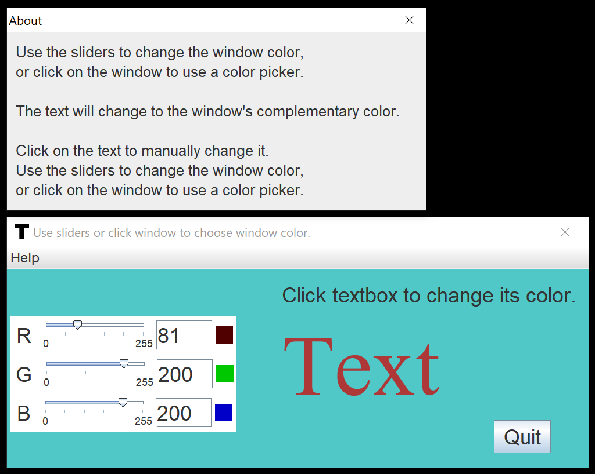

# Text Contrast Color Program

A Java program which allows users to play with text and background color to test the contrast effects.

## Getting Started

Download or git clone this repo and run it with Java 8 or higher versions.

## Compile the Program

Run this command on the root folder of the source code.

```
javac -cp src -d bin src/app/App.java
```

.class files will be generated in the bin folder.

Then type this command to create a .jar file:

```
cd bin
jar cfe text.jar app.App *
```

A .jar file named **text.jar** will be created.

## Run the Program

After we get **text.jar** file from compilation, we can use the following command to run the .jar file:

```
java -jar text.jar
```

## Usage Examples



- Use the RGB sliders to change background colors. The text color will change as well in contrast to the background color.

- Enter a number on the text fields beside the RGB sliders, and hit enter to change the RGB values.

- Click on the Text will show up a color picker window. Select a color to change the color of text to test different color sets.

- Click on the background will show up a color picker window. Select a color to change the color of background.

- Click on the Quit button and the program will exit.
